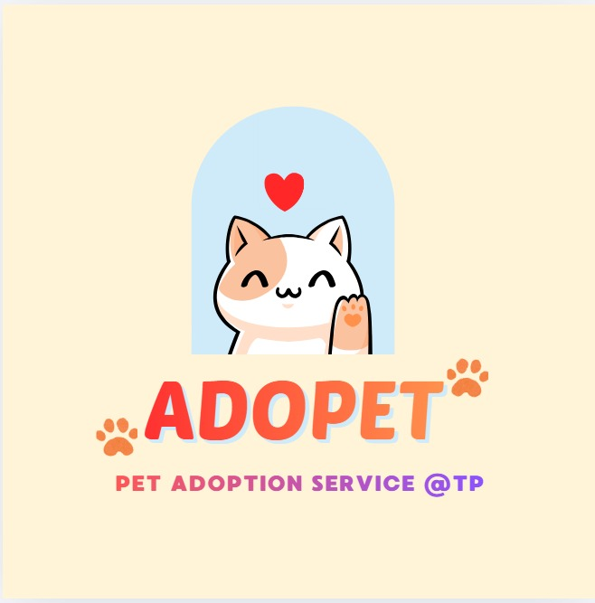

# 🐾 Adopet Web Portal

Welcome to **Adopet**, a modern web portal for animal adoption! This project helps users browse, meet, and adopt pets, while providing admin tools for animal management.

---

## 🚀 Features

- **Pet Gallery:** Browse all available animals with images and details.
- **Meet & Adopt:** Book a meeting to meet your future pet.
- **Add/Update Animals:** Admins can add new animals or update existing profiles.
- **User Registration:** Create an account to request meetings and adopt pets.
- **Developer/Admin Page:** Manage animal records (edit/delete).

---

## 🖼️ Screenshots



---

## 📁 Project Structure

```
project_2_ADEV/
│   db-connections.js      # MySQL connection setup
│   server.js              # Express server and API routes
│   package.json           # Node.js dependencies
│
└───public/
    │   add_animal.html
    │   developer.html
    │   meet-pet.html
    │   Pet-gallery.html
    │   update_ani.html
    │   User-login.html
    │   welcome.html
    ├───css/
    │     style.css
    ├───images/
    │     (pet images, logo)
    └───js/
          adoption.js
          testAPI.js
```

---

## ⚙️ Setup & Usage

1. **Clone the repository:**
   ```bash
   git clone https://github.com/yourusername/adopet-web-portal.git
   cd adopet-web-portal
   ```
2. **Install dependencies:**
   ```bash
   npm install
   ```
3. **Configure MySQL:**
   - Update `db-connections.js` with your MySQL credentials.
   - Ensure the database `ani_adopt` and required tables exist.
4. **Run the server:**
   ```bash
   node server.js
   ```
5. **Open in browser:**
   - Visit [http://127.0.0.1:8080/Pet-gallery.html](http://127.0.0.1:8080/Pet-gallery.html)

---

## 📝 Tech Stack
- Node.js
- Express.js
- MySQL
- HTML/CSS/JavaScript

---

## 🤝 Contributing
Pull requests are welcome! For major changes, please open an issue first to discuss what you would like to change.

---

## 📄 License
This project is licensed under the ISC License.

---

## 💡 Inspiration
Adopet was created to make pet adoption easy, transparent, and joyful for everyone!
